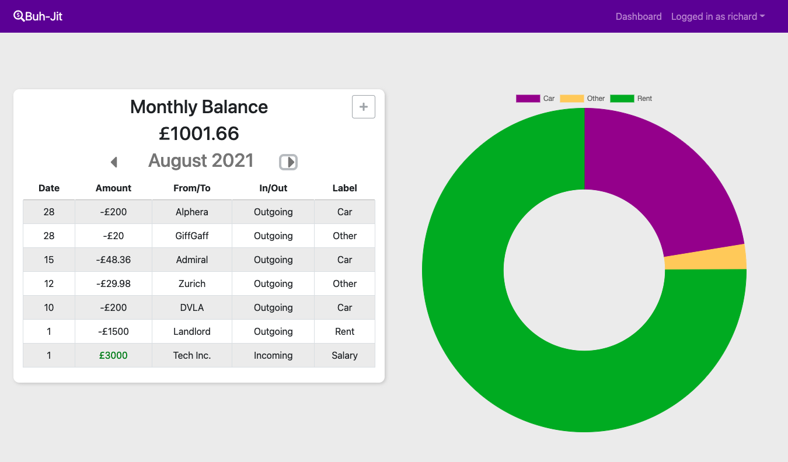
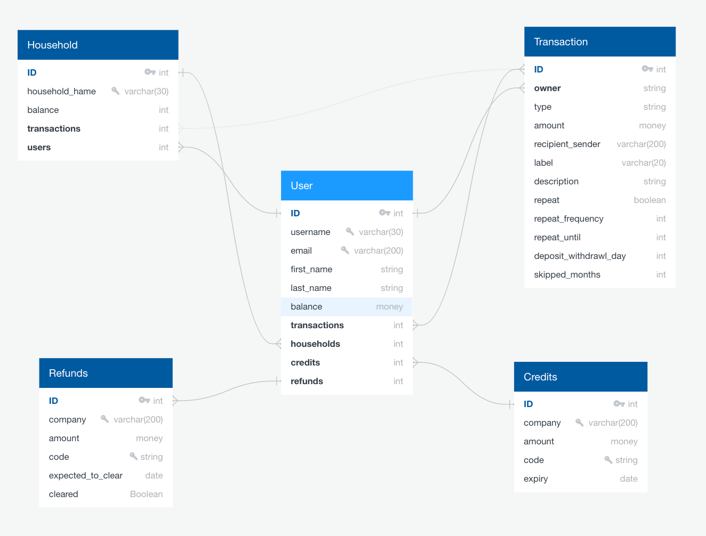
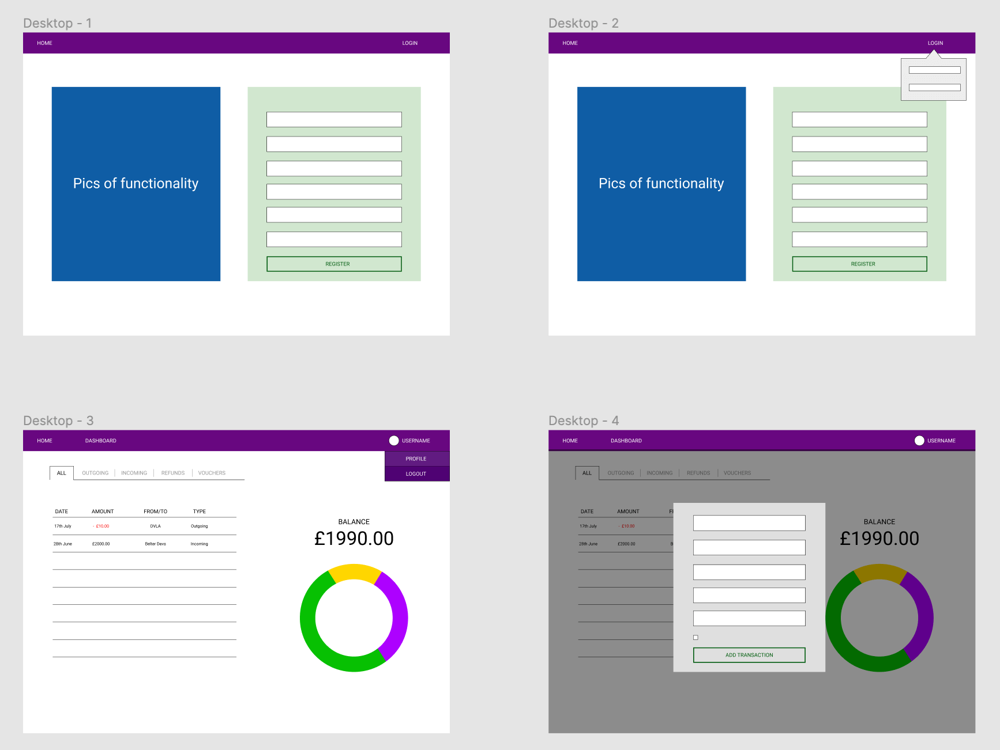
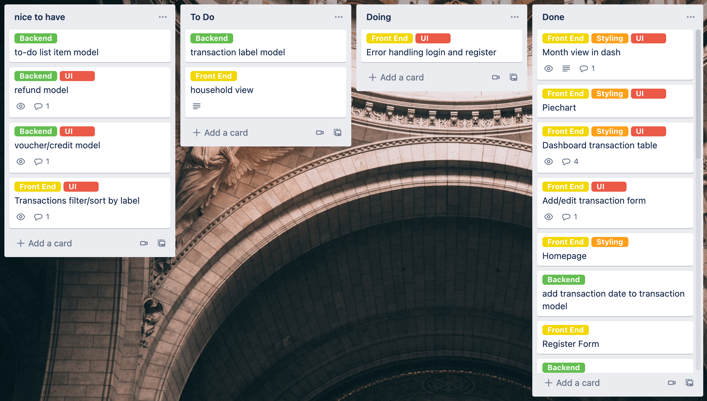

# Buh-Jit
Software Engineering Immersive Course || Project-4 || Individual Project || 1 week

## Overview

Buh-jit is a budgeting app that allows you to add transactions and visualise your spending month-to-month.
 
<p align="center" >
 
</p>
 
[Buh-jit - Deployed App](https://bit.ly/buh-jit)

## Installation

- Clone the repo
- In route add/install ```pipenv```
- Move into shell with ```pipenv shell``` 
- Make Migrations with ```python manage.py makemigrations```
- Migrate with ```python manage.py migrate```
- Load user seeds with ```python manage.py loaddata jwt_auth/seeds.json```
- Load transaction seeds with ```python manage.py loaddata transactions/seeds.json```
- Split Terminal window and move into ```client``` folder with ```cd client```
- Install all frontend packages (from package.json) by running ```yarn```
- IN ROOT, start server with ```python manage.py runserver```
- IN CLIENT, start frontend with ```yarn start```
 
 
## Table of Contents
[The Brief](#the-brief) <br>
[The Build](#the-build) <br>
[Code Examples](#code-examples) <br>
[Wins](#wins) <br>
[Challenges](#challenges) <br>
[Bugs](#bugs) <br>
[Future Improvements](#future-improvements) <br>
[Key Learnings](#key-learnings) <br>

 
 
## The Brief
 
Create a fullstack application with CRUD functionality using Django, PostrgreSQL, React and Node.

With this project I wanted to develop an app that had real world value and be very different from my third project.

I thought about apps that I would find useful and became fixated on making my household budgeting spreadsheet an intuitive, user-friendly app!

<br>
 
## The Build

Taking lessons learned from my third project I really was more stringent in planning this app. I knew 1 week would not be long enough to implement the complex functionality I wanted the app to have long term but I knew there was massive potential here that needed to be accommodated at the beginning of the project.

I began by noting all of the funcitonality I expected the final app to have before planning my models and their relationships. While the key models are users and transactions, I also wanted to have 'household functionlity' - where multiple users can add transactions relative to a combined household.

<p align="center" >
 
</p>

The app also had to be very user friendly and intuitive to use. I created a rough wireframe of how I wanted the app to look and flow. I wanted it to be clean and display the information in a simple way, using as few paths as possible - an elegant dashboard that all of the information could be accessed from.

<p align="center" >
 
</p>

With models, relationships and flow ideated I used Trello to plan the project in a Kanban system. Using labels to differentiate between frontend, backend, styling and UI I created cards for each task. When creating the cards I used comments to add any thoughts I had on how to achieve the task or any considerations to be mindful of for that task.

<p align="center" >
 
</p>


I started building out the backend models, serializers and views. With the users and transactions being the foundation of the app I worked on these first, testing them on Django's admin path and Insomnia in the absence of my own 'client'. I really enjoyed using the Django REST framework and found it to be a great help for the functional heavy lifting in the backend.

With the fundamental backend apps in place as well as some extras for future development I connected the front end. 

The format of the app means that the CRUD functionality of transactions is only accessible to the user logged in and is handled on the frontend. They are only shown transactions attached to their account and there are no paths that allow them access to other transactions.

As I had been able to register users through Insomnia I started with the navbar and adding 'Login' functionality so that I could store the token - and therefore user information - in local storage. With this I could use a ternary to decide what should be shown on the navbar.


```js

 export const getTokenFromLocalStorage = () => {
  return window.localStorage.getItem('token')
}


export const getPayload = () => {
  const token = getTokenFromLocalStorage()

  if (!token) return

  const splitToken = token.split('.')
  if (splitToken.length < 3) return
  return JSON.parse(atob(splitToken[1]))

}


export const getCurrentUser = async () => {

  const payload = getPayload()

  if (!payload) return

  const { data } = await axios.get('/api/auth/profile/',
    {
      headers: {
        Authorization: `Bearer ${getTokenFromLocalStorage()}`,
      },
    }
  )

  return data

}

 
```

<br>
 
 
## Code Examples
 
 


<br>
 
 
## Wins

 
## Challenges
 
 
## Bugs
 
 
## Future Improvements


## Key Learnings

 


